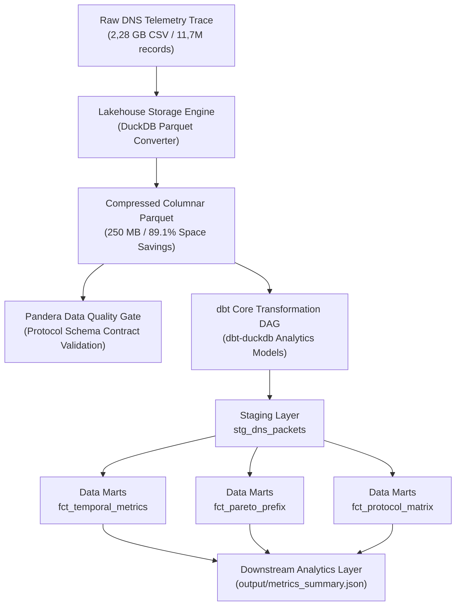

# Pipeline Telemetri & Analisis Operasional DNS (11,7 Juta Pesan)

> Pipeline rekayasa data berkecepatan tinggi berbasis Modern Data Stack (DuckDB, Apache Parquet, dbt Core, Pandera) untuk pemrosesan log DNS skala besar, pemodelan analitik, dan penegakan kontrak kualitas data.

---

## Daftar Isi

- [Tentang](#tentang)
- [Fitur Utama](#fitur-utama)
- [Tech Stack](#tech-stack)
- [Dataset dan Kamus Data](#dataset-dan-kamus-data)
- [Arsitektur Sistem](#arsitektur-sistem)
- [Benchmark Performa](#benchmark-performa)
- [Pemodelan Data dan dbt](#pemodelan-data-dan-dbt)
- [Kontrak Kualitas Data](#kontrak-kualitas-data)
- [Perlindungan Data dan Keamanan](#perlindungan-data-dan-keamanan)
- [Struktur Repositori](#struktur-repositori)
- [Mulai Cepat](#mulai-cepat)
- [Aturan Merge dan Perlindungan Branch](#aturan-merge-dan-perlindungan-branch)
- [Modul dan Komponen](#modul-dan-komponen)
- [Temuan Operasional](#temuan-operasional)
- [Angka Kunci dan Sumber](#angka-kunci-dan-sumber)
- [Pemecahan Masalah](#pemecahan-masalah)
- [Lisensi](#lisensi)

---

## Tentang

Repositori ini mengimplementasikan pipeline rekayasa data (*data engineering*) berstandar industri modern (*Modern Data Stack*) untuk memproses **11.712.623 rekaman telemetri DNS otoritatif** (2,28 GB data mentah) dalam jendela pengamatan 30 menit.

### Masalah yang Dijawab
1. **Optimalisasi Penyimpanan dan Throughput**: Mengonversi berkas CSV besar menjadi Apache Parquet terkompresi ZSTD, mereduksi konsumsi ruang disk hingga **89,1% (dari 2.285 MB menjadi 250 MB)** hanya dalam 6,55 detik.
2. **Pemrosesan Kolumnar Sub-Detik**: Menggantikan pemindaian baris tradisional dengan mesin kolumnar **DuckDB** yang mampu mengeksekusi analitik skala 11,7 juta baris hingga **71x lebih cepat** dibandingkan Pandas.
3. **Standardisasi Pemodelan Data Enterprise**: Mengintegrasikan **dbt Core** dengan adapter `dbt-duckdb` untuk orkestrasi transformasi modular (lapisan *staging* dan *data marts*) lengkap dengan pengujian otomatis (*schema tests*).
4. **Penegakan Kontrak Kualitas Data**: Menerapkan validasi skema berbasis **Pandera** untuk memastikan kepatuhan protokol RFC sebelum data masuk ke lapisan analitik.

---

## Fitur Utama

- **Storage Lakehouse Parquet**: Konversi otomatis CSV ke Parquet terkompresi ZSTD dengan penghematan ruang sebesar 89,1%.
- **Dual Analytical Engine**: Dukungan eksekusi fleksibel melalui mesin Pandas C-engine maupun mesin kolumnar DuckDB berkecepatan tinggi.
- **dbt Data Transformation Layer**: Model *staging* (`stg_dns_packets`) dan 3 model *marts* (`fct_temporal_metrics`, `fct_pareto_prefix`, `fct_protocol_matrix`) yang tereksekusi penuh dalam 4,13 detik.
- **Automated Data Quality Testing**: 16 *data tests* dbt (12 uji skema generik dan 4 uji singular rekonsiliasi analitik) yang lulus 100%, ditambah kontrak skema protokol via Pandera.
- **Deterministic Spike Decomposition**: Membedah lonjakan galat NXDOMAIN menit puncak terhadap *steady-state baseline* secara matematis.
- **JSON Telemetry Export**: Serialisasi data metrik terkomputasi ke berkas JSON terstruktur untuk konsumsi hilir (*downstream consumption*).

---

## Tech Stack

| Komponen | Teknologi | Versi | Peran dan Alasan Pemilihan |
|---|---|---|---|
| Query Engine | DuckDB | 1.5.6 | Mesin analitik kolumnar vektorisasi, menjalankan kueri 11,7M baris dalam hitungan milidetik |
| Storage Layer | Apache Parquet / PyArrow | 25.0.1 | Format penyimpanan kolumnar terkompresi ZSTD dengan pemindaian *zero-copy* |
| Data Modeling | dbt Core | 1.12.5 | Standar transformasi data, dokumentasi *lineage*, dan *data testing* |
| dbt Adapter | dbt-duckdb | 1.11.0 | Mengizinkan eksekusi dbt 100% lokal tanpa biaya komputasi *cloud data warehouse* |
| Data Quality | Pandera | 0.34.1 | Penegakan kontrak skema data (*data contracts*) dan validasi kepatuhan tipe protokol |
| Baseline Engine | Pandas & NumPy | 3.0.6 / 2.5.3 | Pemrosesan data tabular alternatif dan operasi array numerik |
| Ekstraksi Domain | PublicSuffix2 | 2.20191221 | Ekstraksi SLD (*Second-Level Domain*) resmi berbasis Public Suffix List |

---

## Dataset dan Kamus Data

Dataset telemetri yang diproses oleh pipeline ini merupakan rekaman log transaksi paket DNS (*DNS network packet telemetry*) pada server nama otoritatif dalam jendela observasi 30 menit. Setiap baris data merepresentasikan satu paket jaringan DNS individual (baik paket kueri masuk maupun respons keluar), lengkap dengan metadata lapisan transport (IPv4/IPv6, UDP/TCP), rincian header DNS RFC 1035, flag resolusi, kode status galat, serta opsi ekstensi EDNS0 (RFC 6891).

### Kamus Data (Data Dictionary)

| Kolom | Tipe data | Arti |
|---|---|---|
| `ts` | Float64 / Double | Waktu penangkapan paket dalam format UNIX epoch timestamp (detik dengan presisi mikrodetik UTC). |
| `ts_iso` | Timestamp (UTC) | Waktu penangkapan paket dalam format standar ISO-8601 UTC (`YYYY-MM-DDTHH:MM:SSZ`). |
| `ip_ver` | Int8 | Versi protokol Internet yang digunakan: `4` untuk IPv4 atau `6` untuk IPv6. |
| `proto` | Varchar / Category | Protokol lapisan transport jaringan: `udp` atau `tcp`. |
| `src_ip` | Varchar / String | Alamat IP pengirim (IP sumber klien pada query, atau IP server penanggap pada response). |
| `src_port` | UInt16 | Nomor port sumber pada lapisan transport (rentang dinamis klien 1024 - 65535). |
| `dst_ip` | Varchar / String | Alamat IP tujuan (IP server DNS pada query, atau IP klien penerima pada response). |
| `dst_port` | UInt16 | Nomor port tujuan pada lapisan transport (standar port 53 untuk layanan DNS). |
| `frame_len` | UInt32 | Panjang total frame paket jaringan yang tertangkap dalam satuan byte. |
| `dns_len` | UInt32 | Panjang payload lapisan protokol DNS dalam satuan byte. |
| `dns_id` | UInt16 | Transaction Identifier (ID transaksi DNS 16-bit) untuk mencocokkan query klien dengan respons server. |
| `qr` | Int8 | Flag arah pesan DNS: `0` untuk Pertanyaan (Query), `1` untuk Tanggapan (Response). |
| `opcode` | Int8 | Jenis operasi query DNS RFC 1035 (`0` = Standard Query / QUERY, `1` = IQUERY, `2` = STATUS). |
| `aa` | Int8 | Flag Authoritative Answer: `1` jika server penanggap adalah otoritatif atas domain yang diminta, `0` jika bukan. |
| `tc` | Int8 | Flag Truncation: `1` jika pesan terpotong karena melampaui batas transmisi UDP, `0` jika utuh. |
| `rd` | Int8 | Flag Recursion Desired: `1` jika klien meminta server melakukan resolusi rekursif, `0` jika iteratif. |
| `ra` | Int8 | Flag Recursion Available: `1` jika server mendukung layanan resolusi rekursif, `0` jika tidak tersedia. |
| `ad` | Int8 | Flag Authentic Data (DNSSEC): `1` jika seluruh data jawaban telah diverifikasi secara kriptografis oleh server. |
| `cd` | Int8 | Flag Checking Disabled (DNSSEC): `1` jika klien menonaktifkan verifikasi keamanan DNSSEC oleh server. |
| `rcode` | Int16 | Kode hasil respons DNS RFC 1035/8914 (`0` = NOERROR, `1` = FORMERR, `2` = SERVFAIL, `3` = NXDOMAIN, `5` = REFUSED; bernilai null pada query). |
| `qdcount` | UInt16 | Jumlah rekaman entri pertanyaan dalam seksi pertanyaan (Question Section) header DNS. |
| `ancount` | UInt16 | Jumlah rekaman data jawaban (Answer Resource Records) yang dikembalikan dalam respons. |
| `nscount` | UInt16 | Jumlah rekaman server nama otoritatif (Authority Records) dalam respons. |
| `arcount` | UInt16 | Jumlah rekaman tambahan (Additional Records) dalam respons, termasuk record opsi EDNS. |
| `qname` | Varchar / String | Nama domain lengkap (Fully Qualified Domain Name / FQDN) yang ditanyakan oleh klien (contoh: `example.com.`). |
| `qtype` | UInt16 | Kode numerik tipe rekaman DNS yang diminta (`1` = A, `28` = AAAA, `15` = MX, `16` = TXT, `255` = ANY). |
| `qtype_name` | Varchar / Category | Representasi label string dari tipe kueri DNS (contoh: `A`, `AAAA`, `MX`, `TXT`, `ANY`). |
| `qclass` | UInt16 | Kelas kueri DNS (`1` = IN / Internet Class). |
| `edns` | Int8 | Flag keberadaan ekstensi EDNS0 RFC 6891: `1` jika menyertakan pseudo-RR OPT, `0` jika DNS standar. |
| `edns_udpsize` | UInt16 | Ukuran buffer payload UDP maksimum yang dapat diterima oleh resolver klien (contoh: 1232 atau 4096 byte). |
| `do` | Int8 | Flag DNSSEC OK dalam OPT RR: `1` jika resolver klien siap menerima rekaman keamanan DNSSEC (RRSIG, DNSKEY). |
| `ecs` | Varchar / String | Subnet prefix klien dari opsi EDNS Client Subnet (RFC 7871) jika disertakan dalam query/response. |
| `ecs_scope` | Int16 / BigInt | Panjang cakupan prefix (scope prefix-length) dari opsi EDNS Client Subnet. |
| `answers` | Varchar / String | Serialisasi string representasi data rekaman jawaban DNS (Resource Record values). |

---

## Arsitektur Sistem

Alur data terstruktur mengikuti prinsip *Lakehouse & Modern Data Stack*:



---

## Benchmark Performa

Uji performa perbandingan mesin analitik dijalankan pada dataset DNS dengan parameter lingkungan yang identik:

| Mesin Eksekusi | Format Data | Waktu Eksekusi | Penggunaan Delta RAM | Peningkatan Kecepatan |
|---|---|---|---|---|
| Pandas (C-Engine) | CSV Mentah (2,28 GB) | 1,34 detik | 95,9 MB | 1,0x (Baseline) |
| DuckDB (Direct Scan) | CSV Mentah (2,28 GB) | 0,22 detik | 0,0 MB | **6,0x lebih cepat** |
| DuckDB (Columnar Scan) | Parquet ZSTD (250 MB) | 0,02 detik | 0,0 MB | **71,8x lebih cepat** |

### Efisiensi Kompresi Storage
- **Ukuran CSV Mentah**: 2.285,2 MB
- **Ukuran Parquet ZSTD**: 250,0 MB
- **Pengurangan Ruang Disk**: **89,1% hemat ruang**
- **Waktu Konversi**: **6,55 detik** (throughput konversi ~350 MB/detik)

---

## Pemodelan Data dan dbt

Transformasi data dimodelkan secara modular di dalam direktori `dbt_dns/`:

| Nama Model | Lapisan | Materialisasi | Deskripsi Model |
|---|---|---|---|
| `stg_dns_packets` | Staging | View | Pembersihan tipe data, ekstraksi timestamp UTC, pelabelan jenis pesan, dan pemetaan prefiks IPv6 /48 |
| `fct_temporal_metrics` | Marts | Table | Agregasi performa jaringan per menit (laju paket, tingkat galat NXDOMAIN, rasio pemotongan UDP) |
| `fct_pareto_prefix` | Marts | Table | Pemeringkatan prefiks sumber /48 berdasarkan volume kueri beserta kalkulasi pangsa kumulatif Pareto 80/20 |
| `fct_protocol_matrix` | Marts | Table | Tabulasi silang distribusi kode respons RCODE untuk setiap tipe rekaman QTYPE |

### Hasil Eksekusi dbt
- **Transformasi (`dbt run`)**: 4 model selesai dalam **4,13 detik**.
- **Pengujian Kualitas Data (`dbt test`)**: 16 pengujian data (12 uji skema generik *not-null*, *unique*, *accepted values* serta 4 uji singular rekonsiliasi analitik) lulus 100% dalam **0,62 detik**.

---

## Kontrak Kualitas Data

Melalui modul `src/validation.py`, penegakan kontrak skema berbasis Pandera memeriksa data sebelum kalkulasi analitik dijalankan. Proyek ini membedakan secara tegas antara batasan protokol jaringan standar (RFC) dan kebijakan operasional kualitas data:

1. **Batasan Protokol RFC**:
   - Nilai flag pesan `qr` wajib bernilai 0 (Query) atau 1 (Response) sesuai RFC 1035.
   - Protokol transport `proto` wajib berada di dalam himpunan protokol DNS valid (`['udp', 'tcp']`).
   - Kode respons `rcode` berada pada rentang yang dialokasikan IANA (0 sampai 23).
   - Panjang frame `frame_len` dan panjang payload DNS `dns_len` wajib bernilai positif (> 0).

2. **Kebijakan Kualitas Data Proyek**:
   - Nilai `qdcount` dibatasi pada rentang operasional wajar (0 sampai 20) untuk menyaring anomali paket malformed yang menyimpang dari pola query normal.
   - Pengecekan konsistensi waktu memastikan timestamp berada dalam rentang observasi yang valid.

---

## Perlindungan Data dan Keamanan

Repositori ini menerapkan kebijakan ketat perlindungan kerahasiaan data (*zero-data leakage policy*):

### Kebijakan Data Terbatas
1. **Pencegahan Commit Data Asli**: Seluruh berkas dataset DNS mentah (`data/*.csv`, `data/*.parquet`), tangkapan paket (`*.pcap`, `*.pcapng`), basis data DuckDB lokal (`data/*.duckdb`), kredensial (`.env*`, `*.pem`, `*.key`), dan keluaran analitik (`output/*.json`) dicegah masuk ke Git melalui `.gitignore`.
2. **Kemandirian Pengujian Sintetis**: Seluruh pengujian CI, pytest, dan dbt build dijalankan secara terisolasi menggunakan data sintetis deterministik yang digenerate oleh `scripts/generate_sample_data.py`.
3. **Pembersihan Keluaran Notebook**: Berkas Jupyter notebook diperiksa untuk memastikan tidak memuat riwayat eksekusi cell yang berpotensi membocorkan data sensitif.

### Git Hooks (Pre-Commit & Pre-Push)
Untuk melindungi kode sebelum terkirim ke remote:
- **`pre-commit`**: Memeriksa berkas yang berada dalam area *staged* sebelum perintah `git commit` diselesaikan.
- **`pre-push`**: Mengaudit seluruh rentang commit (*commit range*) yang akan dikirim ke remote (`remote_ref..local_ref`), bukan hanya *working tree* terakhir. Hal ini mencegah pengiriman commit lama yang membawa berkas terlarang.

> [!IMPORTANT]
> Git hooks tidak otomatis aktif setelah proses `git clone`. Pengembang wajib mengaktifkan konfigurasi hooks lokal dengan menjalankan:
> ```bash
> git config core.hooksPath .githooks
> ```

### Batasan Deteksi & Pencegahan Dini
- **Batas Deteksi Scanner**: Pemindai rahasia lokal (`scripts/data_protection_check.py` dan `detect-secrets`) mendeteksi token berentropi tinggi dan pola kredensial terstruktur. Scanner **tidak dapat secara otomatis mengenali seluruh variasi alamat IP, prefiks jaringan, domain privat, atau data pribadi (PII)** tanpa pola format spesifik. Oleh karena itu, disiplin pengembang dan pembatasan via `.gitignore` merupakan garis pertahanan utama.
- **Pencegahan Sebelum Push**: Jangan pernah mengandalkan event `push` pada CI GitHub Actions sebagai mekanisme proteksi utama, karena data sensitif yang terdorong telah sampai di server remote sebelum workflow CI dijalankan. Perlindungan wajib dilakukan secara lokal pada level pre-commit dan pre-push.
- **Keamanan Log**: Pemindai tidak menampilkan nilai rahasia di konsol atau log; pemindai hanya menampilkan kategori temuan, nama berkas, dan nomor baris.

## Struktur Repositori

```
.
├── .github/
│   └── workflows/
│       └── ci.yml              # Pipeline CI GitHub Actions (Lint, Security, Pytest Matrix, dbt)
├── .githooks/                  # Git hooks perlindungan data lokal
│   ├── pre-commit              # Validasi file staged sebelum commit
│   └── pre-push                # Audit commit range sebelum transmisi push
├── main.py                     # Entrypoint wrapper ringan yang meneruskan ke src.cli
├── pyproject.toml              # Konfigurasi build metadata, pytest, dan ruff
├── requirements.txt            # Dependensi produksi Python terverifikasi
├── LICENSE                     # Lisensi proyek (MIT)
├── tests/                      # Rangkaian pengujian unit dan kontrak kualitas data
│   ├── conftest.py             # Fixture data telemetri sintetis deterministik
│   ├── test_validation.py      # Uji penegakan kontrak skema Pandera
│   ├── test_metrics.py         # Uji agregasi temporal, Pareto, kontingensi QTYPE
│   ├── test_anomaly.py         # Uji dekomposisi burst NXDOMAIN menit puncak
│   ├── test_duck_engine.py     # Uji konversi Parquet dan agregasi DuckDB
│   ├── test_cli.py             # Uji integrasi eksekusi end-to-end CLI
│   └── test_analytics_truth.py # Uji kebenaran analitik matematis & rekonsiliasi
├── scripts/
│   ├── benchmark.py            # Skrip benchmark perbandingan Pandas vs DuckDB
│   ├── generate_sample_data.py # Generator dataset sintetis untuk lingkungan CI
│   └── data_protection_check.py # Scanner perlindungan kerahasiaan data dan rahasia
├── dbt_dns/                    # Proyek dbt Core (adapter DuckDB)
│   ├── dbt_project.yml         # Konfigurasi proyek dbt
│   ├── profiles.yml            # Konfigurasi koneksi database DuckDB lokal terisolasi
│   ├── models/
│   │   ├── staging/            # Lapisan staging (stg_dns_packets.sql)
│   │   └── marts/              # Lapisan analitik (fct_*.sql)
│   └── tests/                  # Uji singular dbt (rekonsiliasi & proteksi nol-baris)
├── src/                        # Paket pipeline modular (arsitektur src-layout)
│   ├── __init__.py             # Inisialisasi package
│   ├── __main__.py             # Entrypoint eksekusi via python -m src
│   ├── cli.py                  # Logika antarmuka baris perintah (CLI orchestrator)
│   ├── config.py               # Konstanta protokol DNS dan skema tipe data
│   ├── loader.py               # Ingestion engine cepat berbasis C-engine
│   ├── duck_engine.py          # Modul DuckDB & konverter Parquet
│   ├── validation.py           # Kontrak skema data quality berbasis Pandera
│   ├── metrics.py              # Agregasi temporal, KPIs, Pareto prefix, cross-tab
│   ├── anomaly.py              # Dekomposisi spike NXDOMAIN dan ekstraksi domain PSL
│   └── exporter.py             # Serialisasi data metrik format JSON
├── output/                     # Direktori luaran hasil komputasi metrik
│   └── metrics_summary.json    # Ringkasan analitik dan agregasi terkomputasi
├── notebooks/                  # Analisis interaktif
│   └── dns_telemetry_analysis.ipynb # Notebook analisis mendalam dan eksplorasi data
└── data/                       # Direktori dataset sumber (terisolasi lokal)
    ├── sample-dns-30min.csv    # Dataset mentah telemetri DNS (2,28 GB)
    ├── sample-dns-30min.parquet # Dataset kolumnar terkompresi ZSTD (250 MB)
    └── dns_analytics.duckdb    # Database analitik lokal DuckDB hasil dbt
```

---

## Mulai Cepat

### Prasyarat
- Python 3.10 atau versi lebih baru (teruji pada Python 3.14.4).
- RAM minimal 4 GB saat menggunakan Parquet/DuckDB (atau minimal 16 GB untuk pemrosesan Pandas CSV penuh).
- Ruang disk kosong minimal 3 GB.

### 1. Pemasangan Lingkungan & Aktivasi Git Hooks

```bash
python3 -m venv .venv
source .venv/bin/activate
pip install -r requirements.txt

# Wajib: Aktifkan git hooks lokal untuk perlindungan data
git config core.hooksPath .githooks
```

### 2. Opsi Eksekusi Pipeline CLI

Pipeline dapat dijalankan melalui modul paket (`python -m src`) maupun melalui wrapper root (`python main.py`):

```bash
# 1. Konversi CSV mentah ke Parquet terkompresi ZSTD (hanya butuh ~6 detik)
python -m src --to-parquet

# 2. Jalankan pengujian kontrak data quality Pandera
python -m src --validate --sample 100000

# 3. Jalankan transformasi dbt dan pengujian assertions otomatis
python -m src --run-dbt

# 4. Jalankan pengujian benchmark komparasi performa
python -m src --benchmark --sample 200000

# 5. Jalankan kalkulasi analitik penuh dan ekspor ringkasan metrik
python -m src
```

### 3. Pengujian Otomatis dan CI Lokal

```bash
# 1. Uji pemformatan dan linting kode
ruff check .
ruff format --check .

# 2. Audit kepatuhan kerahasiaan data dan pemindaian kredensial
python scripts/data_protection_check.py --stage audit

# 3. Eksekusi 22 unit test (kebenaran analitik, Pandera, DuckDB, Metrics, Anomaly, CLI)
pytest tests/ -v

# 4. Eksekusi build dbt lokal (model + 16 uji kualitas data)
dbt build --project-dir dbt_dns --profiles-dir dbt_dns
```

---

## Aturan Merge dan Perlindungan Branch

> [!WARNING]
> Konfigurasi alur kerja di `.github/workflows/ci.yml` mendefinisikan pekerjaan otomatisasi CI. Berkas workflow **tidak secara otomatis mengunci branch** di repositori GitHub. Administrator repositori wajib mengaktifkan kebijakan perlindungan branch (*Branch Protection Rules*) secara manual melalui GitHub Repository Settings.

### Pengaturan GitHub yang Wajib Diterapkan

Untuk menjamin kualitas analitik dan mencegah kebocoran data tak sengaja, branch `main` harus dikonfigurasi melalui menu **Settings > Branches > Branch protection rules**:

1. **Require a pull request before merging**:
   - Aktifkan opsi `Require approvals` (minimal 1 peninjau kode independen).
   - Aktifkan `Dismiss stale pull request approvals when new commits are pushed`.
   - Cegah penggabungan langsung (*direct push*) ke branch `main`.

2. **Require status checks to pass before merging**:
   - Aktifkan `Require branches to be up to date before merging`.
   - Pilih dan wajibkan seluruh pemeriksaan berikut berstatus sukses:
     - `CI Gatekeeper` (`ci-gate`)
     - `Code Quality & Linting` (`lint-and-format`)
     - `Security & Data Protection Policies` (`security-and-data-protection`)
     - `Unit Tests & Analytical Truth (Python 3.10)`
     - `Unit Tests & Analytical Truth (Python 3.11)`
     - `Unit Tests & Analytical Truth (Python 3.12)`
     - `dbt Models & Data Quality Contracts` (`dbt-pipeline`)

3. **Do not allow bypassing the above settings**:
   - Aktifkan opsi `Do not allow bypassing the above settings` (termasuk untuk Administrator repositori) guna menjamin tidak ada merger darurat yang mengabaikan pemindaian data sensitif dan pengujian analitik.

---

## Modul dan Komponen

| Modul | Fungsi Utama | Masukan / Keluaran |
|---|---|---|
| `src/duck_engine.py` | Mengonversi CSV ke Parquet terkompresi ZSTD dan mengeksekusi kueri analitik kolumnar berkecepatan tinggi via DuckDB. | Input: CSV/Parquet<br/>Output: File Parquet & agregat metrik |
| `src/validation.py` | Menegakkan kontrak skema protokol jaringan menggunakan aturan validasi Pandera. | Input: DataFrame sampel<br/>Output: Status validasi & laporan kepatuhan |
| `src/loader.py` | Memuat CSV menggunakan C-engine dengan tipe data `Int8`, `UInt16`, `UInt32`, dan `category`. | Input: File CSV<br/>Output: DataFrame teroptimasi |
| `src/metrics.py` | Menghitung KPI global, agregasi per menit (*steady-state* 29 menit kanonik), analisis konsentrasi Pareto prefiks IPv6 (/48), dan matriks silang QTYPE x RCODE. | Input: DataFrame<br/>Output: Tabel metrik & Series agregat |
| `src/anomaly.py` | Mendekomposisi lonjakan galat di menit puncak terhadap rata-rata *baseline*, mengelompokkan delta host dan tipe query, serta mengekstrak SLD via Public Suffix List. | Input: Baris NXDOMAIN<br/>Output: Rekonsiliasi delta & peringkat prioritas |
| `src/exporter.py` | Membersihkan objek numerik NumPy/Pandas menjadi tipe JSON aman, mengekspor berkas `metrics_summary.json`. | Input: Dictionary metrik<br/>Output: File JSON |

---

## Temuan Operasional

Berdasarkan eksekusi pipeline pada 29 menit jendela kanonik (*steady-state*):

1. **Beban dan Laju Pesan**:
   - Total pesan yang diproses adalah **11.712.623 pesan** (5.861.701 query dan 5.850.922 respons).
   - Throughput rata-rata mencapai **6.507 pesan/detik**.
2. **Konsentrasi Ekstrem Prefiks (Pareto)**:
   - Satu subnet tunggal (**Subnet S1**) menyerap **47,4%** dari total seluruh query yang masuk.
   - 10 subnet pengirim teratas menyumbang lebih dari 53% total volume query global.
3. **Analisis Lonjakan NXDOMAIN**:
   - Tingkat kegagalan NXDOMAIN global berada di angka **11,54%**.
   - Terjadi lonjakan tajam pada menit **08:02 UTC** mencapai **51.629 NXDOMAIN/menit** (laju kegagalan 22,46%), jauh di atas *baseline* 21.634 NXDOMAIN/menit.
   - Dekomposisi deterministik membuktikan bahwa **50,2%** dari selisih lonjakan bersih (+29.995 galat) disebabkan oleh aktivitas **dua host penerima saja (H1 dan H2)** yang meminta record `NS` dan `DS`.
4. **Truncation Respons UDP**:
   - Rata-rata **5,78% respons UDP terpotong (TC=1)** akibat ukuran jawaban melebihi buffer EDNS0 1232 bytes.
   - Pemotongan terbesar terjadi pada record terkait DNSSEC: **CAA (38,4%)**, **DNSKEY (37,6%)**, dan **DS (37,5%)**.

---

## Angka Kunci dan Sumber

Setiap angka di bawah ini bersumber langsung dari hasil komputasi kode:

| Metrik | Nilai Terhitung | Sumber Perhitungan |
|---|---|---|
| Total Rekaman Pesan | 11.712.623 | `len(df)` pada dataset penuh |
| Ukuran File Mentah CSV | 2.285,2 MB | `os.path.getsize` berkas CSV |
| Ukuran File Parquet ZSTD | 250,0 MB | `os.path.getsize` berkas Parquet |
| Efisiensi Kompresi Penyimpanan | 89,1% | Selisih ukuran file Parquet terhadap CSV |
| Throughput Rata-rata | 6.507 pesan/detik | Total baris dibagi durasi rentang timestamp (1.800 detik) |
| Rasio Global NXDOMAIN | 11,54% | `rcode == 3` terhadap total respons |
| Truncation UDP Rata-rata | 5,78% | Respons UDP dengan flag `tc == 1` pada 29 menit kanonik |
| Pangsa Query Subnet S1 | 47,4% | Agregasi prefiks `/48` tertinggi pada jendela kanonik |
| Puncak NXDOMAIN | 51.629 / menit | Nilai maksimum agregat per menit (menit 08:02 UTC) |
| Kontribusi Top-2 Host Spike | 50,2% | `nx_delta` selisih bersih host H1 dan H2 pada menit 08:02 UTC |
| Kecepatan Eksekusi dbt Run | 4,13 detik | Eksekusi 4 model dbt via adapter DuckDB |
| Kecepatan Eksekusi dbt Test | 0,62 detik | Validasi 16 data tests dbt (12 skema + 4 singular) |

---

## Pemecahan Masalah

| Gejala | Penyebab Umum | Solusi Perbaikan |
|---|---|---|
| `MemoryError` saat menjalankan pipeline Pandas | RAM fisik terbatas pada mesin lokal | Gunakan format Parquet dengan DuckDB atau jalankan dengan parameter `--sample 500000`. |
| `FileNotFoundError: sample-dns-30min.parquet` | Berkas Parquet belum digenerate dari CSV | Jalankan perintah `python main.py --to-parquet` untuk membuat berkas Parquet otomatis. |
| Perintah `dbt` tidak ditemukan di terminal | Virtual environment belum aktif | Pastikan virtual environment telah diaktifkan (`source .venv/bin/activate`) sebelum memanggil perintah `dbt`. |
| Berkas `metrics_summary.json` belum muncul | Pipeline belum dijalankan | Jalankan `python main.py` untuk menghasilkan luaran ringkasan metrik di direktori `output/`. |

---

## Lisensi

Proyek ini dilisensikan di bawah ketentuan [MIT License](LICENSE).
