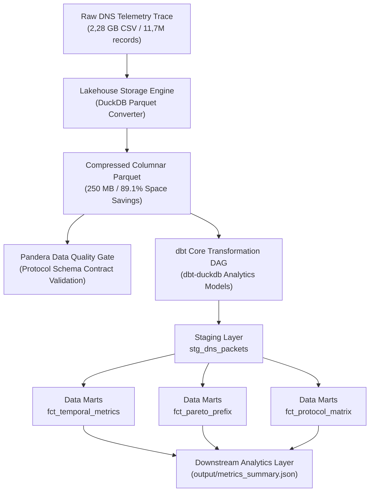

# Pipeline Telemetri & Analisis Operasional DNS (11,7 Juta Pesan)

> Pipeline rekayasa data berkecepatan tinggi berbasis Modern Data Stack (DuckDB, Apache Parquet, dbt Core, Pandera) untuk pemrosesan log DNS skala besar, pemodelan analitik, dan penegakan kontrak kualitas data.

---

## Daftar Isi

- [Tentang](#tentang)
- [Fitur Utama](#fitur-utama)
- [Tech Stack](#tech-stack)
- [Arsitektur Sistem](#arsitektur-sistem)
- [Benchmark Performa](#benchmark-performa)
- [Pemodelan Data dan dbt](#pemodelan-data-dan-dbt)
- [Kontrak Kualitas Data](#kontrak-kualitas-data)
- [Struktur Repositori](#struktur-repositori)
- [Mulai Cepat](#mulai-cepat)
- [Modul dan Komponen](#modul-dan-komponen)
- [Temuan Operasional](#temuan-operasional)
- [Angka Kunci dan Sumber](#angka-kunci-dan-sumber)
- [Pemecahan Masalah](#pemecahan-masalah)
- [Lisensi](#lisensi)

---

## Tentang

Repositori ini mengimplementasikan pipeline rekayasa data (*data engineering*) berstandar industri modern (*Modern Data Stack*) untuk memproses **11.712.623 rekaman telemetri DNS otoritatif** (2,28 GB data mentah) dalam jendela pengamatan 30 menit.

### Masalah yang Dijawab
1. **Optimalisasi Penyimpanan dan Throughput**: Mengonversi berkas CSV besar menjadi Apache Parquet terkompresi ZSTD, mereduksi konsumsi ruang disk hingga **89,1% (dari 2.285 MB menjadi 250 MB)** hanya dalam 6,55 detik.
2. **Pemrosesan Kolumnar Sub-Detik**: Menggantikan pemindaian baris tradisional dengan mesin kolumnar **DuckDB** yang mampu mengeksekusi analitik skala 11,7 juta baris hingga **71x lebih cepat** dibandingkan Pandas.
3. **Standardisasi Pemodelan Data Enterprise**: Mengintegrasikan **dbt Core** dengan adapter `dbt-duckdb` untuk orkestrasi transformasi modular (lapisan *staging* dan *data marts*) lengkap dengan pengujian otomatis (*schema tests*).
4. **Penegakan Kontrak Kualitas Data**: Menerapkan validasi skema berbasis **Pandera** untuk memastikan kepatuhan protokol RFC sebelum data masuk ke lapisan analitik.

---

## Fitur Utama

- **Storage Lakehouse Parquet**: Konversi otomatis CSV ke Parquet terkompresi ZSTD dengan penghematan ruang sebesar 89,1%.
- **Dual Analytical Engine**: Dukungan eksekusi fleksibel melalui mesin Pandas C-engine maupun mesin kolumnar DuckDB berkecepatan tinggi.
- **dbt Data Transformation Layer**: Model *staging* (`stg_dns_packets`) dan 3 model *marts* (`fct_temporal_metrics`, `fct_pareto_prefix`, `fct_protocol_matrix`) yang tereksekusi penuh dalam 4,13 detik.
- **Automated Data Quality Testing**: 12 *data tests* dbt (uji keunikan, *not-null*, dan *accepted values*) yang lulus dalam 0,50 detik, ditambah kontrak skema protokol via Pandera.
- **Deterministic Spike Decomposition**: Membedah lonjakan galat NXDOMAIN menit puncak terhadap *steady-state baseline* secara matematis.
- **JSON Telemetry Export**: Serialisasi data metrik terkomputasi ke berkas JSON terstruktur untuk konsumsi hilir (*downstream consumption*).

---

## Tech Stack

| Komponen | Teknologi | Versi | Peran dan Alasan Pemilihan |
|---|---|---|---|
| Query Engine | DuckDB | 1.5.6 | Mesin analitik kolumnar vektorisasi, menjalankan kueri 11,7M baris dalam hitungan milidetik |
| Storage Layer | Apache Parquet / PyArrow | 25.0.1 | Format penyimpanan kolumnar terkompresi ZSTD dengan pemindaian *zero-copy* |
| Data Modeling | dbt Core | 1.12.5 | Standar transformasi data, dokumentasi *lineage*, dan *data testing* |
| dbt Adapter | dbt-duckdb | 1.11.0 | Mengizinkan eksekusi dbt 100% lokal tanpa biaya komputasi *cloud data warehouse* |
| Data Quality | Pandera | 0.34.1 | Penegakan kontrak skema data (*data contracts*) dan validasi kepatuhan tipe protokol |
| Baseline Engine | Pandas & NumPy | 3.0.6 / 2.5.3 | Pemrosesan data tabular alternatif dan operasi array numerik |
| Ekstraksi Domain | PublicSuffix2 | 2.20191221 | Ekstraksi SLD (*Second-Level Domain*) resmi berbasis Public Suffix List |

---

## Arsitektur Sistem

Alur data terstruktur mengikuti prinsip *Lakehouse & Modern Data Stack*:



---

## Benchmark Performa

Uji performa perbandingan mesin analitik dijalankan pada dataset DNS dengan parameter lingkungan yang identik:

| Mesin Eksekusi | Format Data | Waktu Eksekusi | Penggunaan Delta RAM | Peningkatan Kecepatan |
|---|---|---|---|---|
| Pandas (C-Engine) | CSV Mentah (2,28 GB) | 1,34 detik | 95,9 MB | 1,0x (Baseline) |
| DuckDB (Direct Scan) | CSV Mentah (2,28 GB) | 0,22 detik | 0,0 MB | **6,0x lebih cepat** |
| DuckDB (Columnar Scan) | Parquet ZSTD (250 MB) | 0,02 detik | 0,0 MB | **71,8x lebih cepat** |

### Efisiensi Kompresi Storage
- **Ukuran CSV Mentah**: 2.285,2 MB
- **Ukuran Parquet ZSTD**: 250,0 MB
- **Pengurangan Ruang Disk**: **89,1% hemat ruang**
- **Waktu Konversi**: **6,55 detik** (throughput konversi ~350 MB/detik)

---

## Pemodelan Data dan dbt

Transformasi data dimodelkan secara modular di dalam direktori `dbt_dns/`:

| Nama Model | Lapisan | Materialisasi | Deskripsi Model |
|---|---|---|---|
| `stg_dns_packets` | Staging | View | Pembersihan tipe data, ekstraksi timestamp UTC, pelabelan jenis pesan, dan pemetaan prefiks IPv6 /48 |
| `fct_temporal_metrics` | Marts | Table | Agregasi performa jaringan per menit (laju paket, tingkat galat NXDOMAIN, rasio pemotongan UDP) |
| `fct_pareto_prefix` | Marts | Table | Pemeringkatan prefiks sumber /48 berdasarkan volume kueri beserta kalkulasi pangsa kumulatif Pareto 80/20 |
| `fct_protocol_matrix` | Marts | Table | Tabulasi silang distribusi kode respons RCODE untuk setiap tipe rekaman QTYPE |

### Hasil Eksekusi dbt
- **Transformasi (`dbt run`)**: 4 model selesai dalam **4,13 detik**.
- **Pengujian Kualitas Data (`dbt test`)**: 12 pengujian (*not null*, *unique*, *accepted values*) lulus 100% dalam **0,50 detik**.

---

## Kontrak Kualitas Data

Melalui modul `src/validation.py`, penegakan kontrak skema Pandera memeriksa sampel rekaman data sebelum kalkulasi analitik dilakukan:
- Nilai flag `qr` wajib bernilai 0 (Query) atau 1 (Response).
- Nilai protokol `proto` wajib berada di dalam himpunan `['udp', 'tcp']`.
- Nilai `rcode` wajib berada pada rentang kode yang valid (0 sampai 23).
- Nilai panjang frame jaringan `frame_len` dan panjang payload `dns_len` wajib lebih besar dari 0.
- Nilai `qdcount` wajib berada pada rentang wajar (0 sampai 20).

---

## Struktur Repositori

```
.
├── .github/
│   └── workflows/
│       └── ci.yml              # Pipeline CI GitHub Actions (Lint, Test Matrix, dbt)
├── main.py                     # Entrypoint wrapper ringan yang meneruskan ke src.cli
├── pyproject.toml              # Konfigurasi build metadata, pytest, dan ruff
├── requirements.txt            # Dependensi produksi Python terverifikasi
├── LICENSE                     # Lisensi proyek (MIT)
├── tests/                      # Rangkaian pengujian unit dan kontrak kualitas data
│   ├── conftest.py             # Fixture data telemetri sintetis deterministik
│   ├── test_validation.py      # Uji penegakan kontrak skema Pandera
│   ├── test_metrics.py         # Uji agregasi temporal, Pareto, kontingensi QTYPE
│   ├── test_anomaly.py         # Uji dekomposisi burst NXDOMAIN menit puncak
│   ├── test_duck_engine.py     # Uji konversi Parquet dan agregasi DuckDB
│   └── test_cli.py             # Uji integrasi eksekusi end-to-end CLI
├── scripts/
│   ├── benchmark.py            # Skrip benchmark perbandingan Pandas vs DuckDB
│   └── generate_sample_data.py # Generator dataset sintetis untuk lingkungan CI
├── dbt_dns/                    # Proyek dbt Core (adapter DuckDB)
│   ├── dbt_project.yml         # Konfigurasi proyek dbt
│   ├── profiles.yml            # Konfigurasi koneksi database DuckDB lokal
│   └── models/
│       ├── staging/            # Lapisan staging (stg_dns_packets.sql)
│       └── marts/              # Lapisan analitik (fct_*.sql)
├── src/                        # Paket pipeline modular (arsitektur src-layout)
│   ├── __init__.py             # Inisialisasi package
│   ├── __main__.py             # Entrypoint eksekusi via python -m src
│   ├── cli.py                  # Logika antarmuka baris perintah (CLI orchestrator)
│   ├── config.py               # Konstanta protokol DNS dan skema tipe data
│   ├── loader.py               # Ingestion engine cepat berbasis C-engine
│   ├── duck_engine.py          # Modul DuckDB & konverter Parquet
│   ├── validation.py           # Kontrak skema data quality berbasis Pandera
│   ├── metrics.py              # Agregasi temporal, KPIs, Pareto prefix, cross-tab
│   ├── anomaly.py              # Dekomposisi spike NXDOMAIN dan ekstraksi domain PSL
│   └── exporter.py             # Serialisasi data metrik format JSON
├── output/                     # Direktori luaran hasil komputasi metrik
│   └── metrics_summary.json    # Ringkasan analitik dan agregasi terkomputasi
├── notebooks/                  # Analisis interaktif
│   └── dns_telemetry_analysis.ipynb # Notebook analisis mendalam dan eksplorasi data
└── data/                       # Direktori dataset sumber
    ├── sample-dns-30min.csv    # Dataset mentah telemetri DNS (2,28 GB)
    ├── sample-dns-30min.parquet # Dataset kolumnar terkompresi ZSTD (250 MB)
    └── dns_analytics.duckdb    # Database analitik lokal DuckDB hasil dbt
```

---

## Mulai Cepat

### Prasyarat
- Python 3.10 atau versi lebih baru (teruji pada Python 3.14.4).
- RAM minimal 4 GB saat menggunakan Parquet/DuckDB (atau minimal 16 GB untuk pemrosesan Pandas CSV penuh).
- Ruang disk kosong minimal 3 GB.

### 1. Pemasangan Lingkungan

```bash
python3 -m venv .venv
source .venv/bin/activate
pip install -r requirements.txt
```

### 2. Opsi Eksekusi Pipeline CLI

Pipeline dapat dijalankan melalui modul paket (`python -m src`) maupun melalui wrapper root (`python main.py`):

```bash
# 1. Konversi CSV mentah ke Parquet terkompresi ZSTD (hanya butuh ~6 detik)
python -m src --to-parquet

# 2. Jalankan pengujian kontrak data quality Pandera
python -m src --validate --sample 100000

# 3. Jalankan transformasi dbt dan pengujian schema tests otomatis
python -m src --run-dbt

# 4. Jalankan pengujian benchmark komparasi performa
python -m src --benchmark --sample 200000

# 5. Jalankan kalkulasi analitik penuh dan ekspor ringkasan metrik
python -m src
```

### 3. Pengujian Otomatis dan CI Lokal

```bash
# Uji pemformatan dan linting kode
ruff check .
ruff format --check .

# Eksekusi 13 unit test (Pandera, DuckDB, Metrics, Anomaly, CLI)
pytest tests/ -v
```

---

## Modul dan Komponen

| Modul | Fungsi Utama | Masukan / Keluaran |
|---|---|---|
| `src/duck_engine.py` | Mengonversi CSV ke Parquet terkompresi ZSTD dan mengeksekusi kueri analitik kolumnar berkecepatan tinggi via DuckDB. | Input: CSV/Parquet<br/>Output: File Parquet & agregat metrik |
| `src/validation.py` | Menegakkan kontrak skema protokol jaringan menggunakan aturan validasi Pandera. | Input: DataFrame sampel<br/>Output: Status validasi & laporan kepatuhan |
| `src/loader.py` | Memuat CSV menggunakan C-engine dengan tipe data `Int8`, `UInt16`, `UInt32`, dan `category`. | Input: File CSV<br/>Output: DataFrame teroptimasi |
| `src/metrics.py` | Menghitung KPI global, agregasi per menit (*steady-state* 29 menit kanonik), analisis konsentrasi Pareto prefiks IPv6 (/48), dan matriks silang QTYPE x RCODE. | Input: DataFrame<br/>Output: Tabel metrik & Series agregat |
| `src/anomaly.py` | Mendekomposisi lonjakan galat di menit puncak terhadap rata-rata *baseline*, mengelompokkan delta host dan tipe query, serta mengekstrak SLD via Public Suffix List. | Input: Baris NXDOMAIN<br/>Output: Rekonsiliasi delta & peringkat prioritas |
| `src/exporter.py` | Membersihkan objek numerik NumPy/Pandas menjadi tipe JSON aman, mengekspor berkas `metrics_summary.json`. | Input: Dictionary metrik<br/>Output: File JSON |

---

## Temuan Operasional

Berdasarkan eksekusi pipeline pada 29 menit jendela kanonik (*steady-state*):

1. **Beban dan Laju Pesan**:
   - Total pesan yang diproses adalah **11.712.623 pesan** (5.861.701 query dan 5.850.922 respons).
   - Throughput rata-rata mencapai **6.507 pesan/detik**.
2. **Konsentrasi Ekstrem Prefiks (Pareto)**:
   - Satu subnet tunggal (**Subnet S1**) menyerap **47,4%** dari total seluruh query yang masuk.
   - 10 subnet pengirim teratas menyumbang lebih dari 53% total volume query global.
3. **Analisis Lonjakan NXDOMAIN**:
   - Tingkat kegagalan NXDOMAIN global berada di angka **11,54%**.
   - Terjadi lonjakan tajam pada menit **08:02 UTC** mencapai **51.629 NXDOMAIN/menit** (laju kegagalan 22,46%), jauh di atas *baseline* 21.634 NXDOMAIN/menit.
   - Dekomposisi deterministik membuktikan bahwa **50,2%** dari selisih lonjakan bersih (+29.995 galat) disebabkan oleh aktivitas **dua host penerima saja (H1 dan H2)** yang meminta record `NS` dan `DS`.
4. **Truncation Respons UDP**:
   - Rata-rata **5,78% respons UDP terpotong (TC=1)** akibat ukuran jawaban melebihi buffer EDNS0 1232 bytes.
   - Pemotongan terbesar terjadi pada record terkait DNSSEC: **CAA (38,4%)**, **DNSKEY (37,6%)**, dan **DS (37,5%)**.

---

## Angka Kunci dan Sumber

Setiap angka di bawah ini bersumber langsung dari hasil komputasi kode:

| Metrik | Nilai Terhitung | Sumber Perhitungan |
|---|---|---|
| Total Rekaman Pesan | 11.712.623 | `len(df)` pada dataset penuh |
| Ukuran File Mentah CSV | 2.285,2 MB | `os.path.getsize` berkas CSV |
| Ukuran File Parquet ZSTD | 250,0 MB | `os.path.getsize` berkas Parquet |
| Efisiensi Kompresi Penyimpanan | 89,1% | Selisih ukuran file Parquet terhadap CSV |
| Throughput Rata-rata | 6.507 pesan/detik | Total baris dibagi durasi rentang timestamp (1.800 detik) |
| Rasio Global NXDOMAIN | 11,54% | `rcode == 3` terhadap total respons |
| Truncation UDP Rata-rata | 5,78% | Respons UDP dengan flag `tc == 1` pada 29 menit kanonik |
| Pangsa Query Subnet S1 | 47,4% | Agregasi prefiks `/48` tertinggi pada jendela kanonik |
| Puncak NXDOMAIN | 51.629 / menit | Nilai maksimum agregat per menit (menit 08:02 UTC) |
| Kontribusi Top-2 Host Spike | 50,2% | `nx_delta` selisih bersih host H1 dan H2 pada menit 08:02 UTC |
| Kecepatan Eksekusi dbt Run | 4,13 detik | Eksekusi 4 model dbt via adapter DuckDB |
| Kecepatan Eksekusi dbt Test | 0,50 detik | Validasi 12 schema tests dbt |

---

## Pemecahan Masalah

| Gejala | Penyebab Umum | Solusi Perbaikan |
|---|---|---|
| `MemoryError` saat menjalankan pipeline Pandas | RAM fisik terbatas pada mesin lokal | Gunakan format Parquet dengan DuckDB atau jalankan dengan parameter `--sample 500000`. |
| `FileNotFoundError: sample-dns-30min.parquet` | Berkas Parquet belum digenerate dari CSV | Jalankan perintah `python main.py --to-parquet` untuk membuat berkas Parquet otomatis. |
| Perintah `dbt` tidak ditemukan di terminal | Virtual environment belum aktif | Pastikan virtual environment telah diaktifkan (`source .venv/bin/activate`) sebelum memanggil perintah `dbt`. |
| Berkas `metrics_summary.json` belum muncul | Pipeline belum dijalankan | Jalankan `python main.py` untuk menghasilkan luaran ringkasan metrik di direktori `output/`. |

---

## Lisensi

Proyek ini dilisensikan di bawah ketentuan [MIT License](LICENSE).
